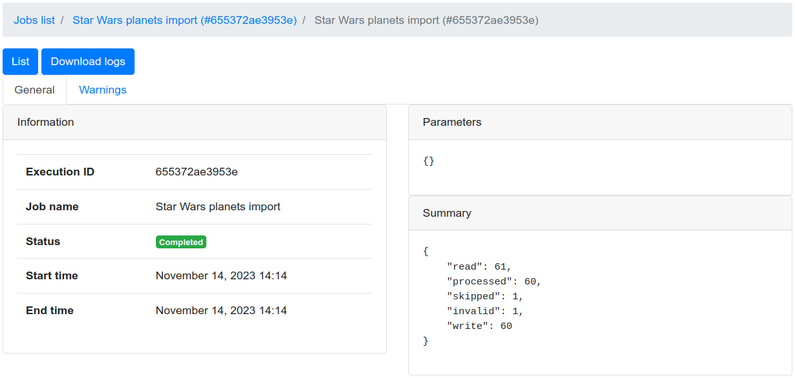
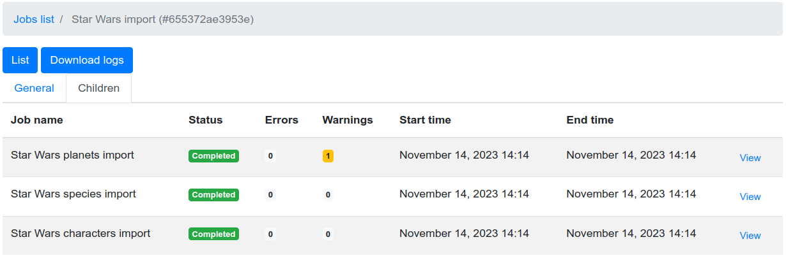
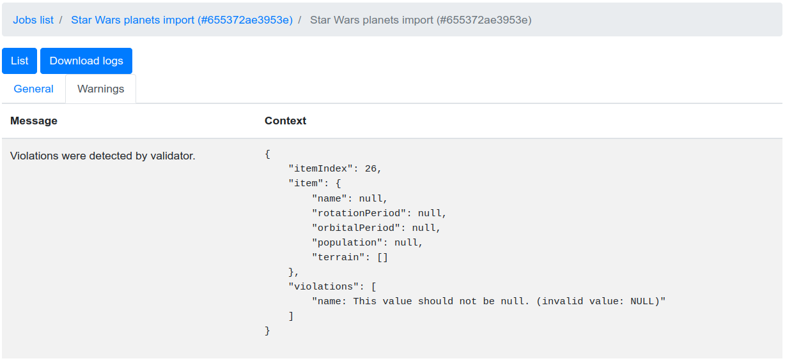
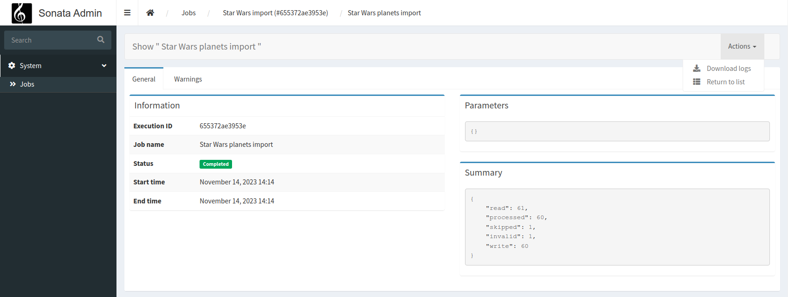
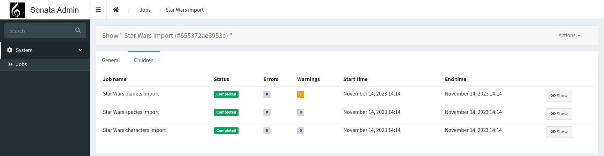

# User Interface

The package is shipped with few routes that will allow you and your users, to watch for `JobExecution`.

   


## Installation

For the UI to be enabled, it is required that you install some dependencies:
```shell
composer require symfony/translation symfony/twig-bundle
```


## Configuration

The UI is disabled by default, you must enable it explicitely:
```yaml
# config/packages/yokai_batch.yaml
yokai_batch:
  ui:
    enabled: true
```

You will also need to import bundle routes:
```yaml
# config/routes/yokai_batch.yaml
_yokai_batch:
  resource: "@YokaiBatchBundle/Resources/routing/ui.xml"
```

### Templating

The templating service is used by the [JobController](../src/UserInterface/Controller/JobController.php) to render its templates.
It's a wrapper around [Twig](https://twig.symfony.com/), for you to control templates used, and variables passed.

> By default
> - the templating will find templates like `@YokaiBatch/bootstrap4/*.html.twig`
> - the template base view will be `base.html.twig`

You can configure a prefix for all templates:
```yaml
# config/packages/yokai_batch.yaml
yokai_batch:
  ui:
    templating:
      prefix: 'batch/job/'
```
> With this configuration, we will look for templates like `batch/job/*.html.twig`.

You can also configure the name of the base template for the root views of that bundle:
```yaml
# config/packages/yokai_batch.yaml
yokai_batch:
  ui:
    templating:
      base_template: 'layout.html.twig'
```
> With this configuration, the template base view will be `layout.html.twig`.

If these are not enough, or if you need to add more variables to context, you can configure a service:
```yaml
# config/packages/yokai_batch.yaml
yokai_batch:
  ui:
    templating:
      service: 'App\Batch\AppTemplating'
```

And create the class that will cover the templating:
```php
<?php

declare(strict_types=1);

namespace App\Batch;

use Yokai\Batch\Bridge\Symfony\Framework\UserInterface\Templating\TemplatingInterface;

final class AppTemplating implements TemplatingInterface
{
    public function name(string $name): string
    {
        return "another-$name"; // change $name if you want
    }

    public function context(array $context): array;
    {
        return \array_merge($context, ['foo' => 'bar']); // add variables to $context if you want
    }
}
```

> **Note** You can also use the `Yokai\Batch\Bridge\Symfony\Framework\UserInterface\Templating\ConfigurableTemplating` that will cover both prefix and static variables at construction.


### Filtering

The `JobExecution` list includes a filter form, but you will need another optional dependency:
```shell
composer require symfony/form
```

### Security

There is no access control over `JobExecution` by default, you will need another optional dependency:
```shell
composer require symfony/security-bundle
```

Every security attribute the bundle is using is configurable:
```yaml
# config/packages/yokai_batch.yaml
yokai_batch:
  ui:
    security:
      attributes:
        list: ROLE_JOB_LIST # defaults to IS_AUTHENTICATED
        view: ROLE_JOB_VIEW # defaults to IS_AUTHENTICATED
        traces: ROLE_JOB_TRACES # defaults to IS_AUTHENTICATED
        logs: ROLE_JOB_LOGS # defaults to IS_AUTHENTICATED
```

Optionally, you can register a voter for these attributes.
This is especially useful if you need different access control rules per `JobExecution`.
```php
<?php

declare(strict_types=1);

namespace App\Security;

use Symfony\Component\Security\Core\Authentication\Token\TokenInterface;
use Symfony\Component\Security\Core\Authorization\Voter\Voter;
use Yokai\Batch\JobExecution;

final class JobVoter extends Voter
{
    protected function supports(string $attribute, mixed $subject): bool
    {
        return \str_starts_with($attribute, 'JOB_');
    }

    /**
     * @param JobExecution|null $subject
     */
    protected function voteOnAttribute(string $attribute, mixed $subject, TokenInterface $token): bool
    {
        // TODO: Implement voteOnAttribute() method.
    }
}
```


## Integration with SonataAdminBundle

If you are on a [SonataAdmin](https://symfony.com/bundles/SonataAdminBundle/current/index.html) project.
The bundle got you covered with a dedicated templating services and templates.

   

```shell
composer require sonata-project/admin-bundle
```

```yaml
# config/packages/yokai_batch.yaml
yokai_batch:
  ui:
    templating: sonata
```
> With this configuration, we will look for templates like `@YokaiBatch/sonata/*.html.twig`.


## Customizing templates

You can override templates like [described it Symfony's documentation](https://symfony.com/doc/current/bundles/override.html).
Examples:
- `templates/bundles/YokaiBatchBundle/bootstrap4/list.html.twig`
- `templates/bundles/YokaiBatchBundle/bootstrap4/show/_parameters.html.twig`

But you can also register job name dedicated templates if you need some specific view for one of your jobs:
- `templates/bundles/YokaiBatchBundle/bootstrap4/show/{job name}/_children-executions.html.twig`
- `templates/bundles/YokaiBatchBundle/bootstrap4/show/{job name}/_failures.html.twig`
- `templates/bundles/YokaiBatchBundle/bootstrap4/show/{job name}/_general.html.twig`
- `templates/bundles/YokaiBatchBundle/bootstrap4/show/{job name}/_information.html.twig`
- `templates/bundles/YokaiBatchBundle/bootstrap4/show/{job name}/_parameters.html.twig`
- `templates/bundles/YokaiBatchBundle/bootstrap4/show/{job name}/_summary.html.twig`
- `templates/bundles/YokaiBatchBundle/bootstrap4/show/{job name}/_warnings.html.twig`

## On the same subject

- [What is a job execution storage ?](https://github.com/yokai-php/batch/blob/0.x/docs/domain/job-execution-storage.md)
- [What is a job ?](https://github.com/yokai-php/batch/blob/0.x/docs/domain/job.md)
- [What is a job launcher ?](https://github.com/yokai-php/batch/blob/0.x/docs/domain/job-launcher.md)
